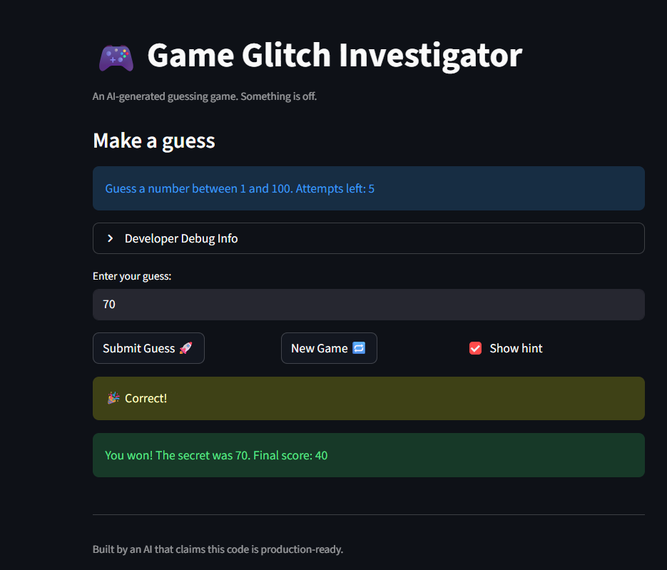

# 🎮 Game Glitch Investigator: The Impossible Guesser

## 🚨 The Situation

You asked an AI to build a simple "Number Guessing Game" using Streamlit.
It wrote the code, ran away, and now the game is unplayable.

- You can't win.
- The hints lie to you.
- The secret number seems to have commitment issues.

## 🛠️ Setup

1. Install dependencies: `pip install -r requirements.txt`
2. Run the broken app: `python -m streamlit run app.py`

## 🕵️‍♂️ Your Mission

1. **Play the game.** Open the "Developer Debug Info" tab in the app to see the secret number. Try to win.
2. **Find the State Bug.** Why does the secret number change every time you click "Submit"? Ask ChatGPT: _"How do I keep a variable from resetting in Streamlit when I click a button?"_
3. **Fix the Logic.** The hints ("Higher/Lower") are wrong. Fix them.
4. **Refactor & Test.** - Move the logic into `logic_utils.py`.
   - Run `pytest` in your terminal.
   - Keep fixing until all tests pass!

## 📝 Document Your Experience

**Game Purpose:**  
The Game Glitch Investigator is an AI-generated number guessing game built with Streamlit. The player tries to guess a secret number within a range (1-100 for Normal difficulty, 1-20 for Easy, 1-50 for Hard) with a limited number of attempts. The game provides feedback hints to guide the player higher or lower than their guess.

**Bugs Found:**

1. **Missing Range Validation**: The game accepted invalid inputs outside the valid range—negative numbers like -34 and numbers over 100 were incorrectly accepted as valid guesses.
2. **Backwards Hint Messages**: When a player's guess was too high, the game said "Go HIGHER!" when it should have said "Go LOWER!" The hint logic was completely reversed.

**Fixes Applied:**

1. **Range Validation Fix**: Added input validation to `parse_guess()` that rejects any guess outside [low, high] for the current difficulty, returning a clear error message to the player.
2. **Hint Message Fix**: Corrected the comparison logic in `check_guess()` so "Too High" outcomes now display "📉 Go LOWER!" and "Too Low" outcomes display "📈 Go HIGHER!"
3. **Code Refactoring**: Separated game logic from UI by moving `parse_guess()`, `check_guess()`, `get_range_for_difficulty()`, and `update_score()` from app.py into logic_utils.py for better code organization.

## 📸 Demo

**Pytest tests passing - 12/12 tests passed:**

## 🚀 Stretch Features

- [ ] [If you choose to complete Challenge 4, insert a screenshot of your Enhanced Game UI here]
